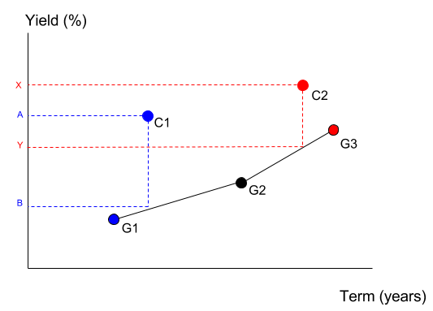

# Coding Challenges

Calculate the yield spread (return) between a corporate bond and its government bond benchmark.

Calculate the spread to the government bond curve. 

## Challenge 1

Calculate the yield spread (return) between a corporate bond and its government bond benchmark.
A government bond is a good benchmark if it is as close as possible to the corporate bond in terms of years to maturity (term).

#### Sample input

| bond | type       | term       | yield |
| ---- | ---------- | ---------- | ----- |
| C1   | corporate  | 10.3 years | 5.30% |
| G1   | government | 9.4 years  | 3.70% |
| G2   | government | 12 years   | 4.80% |

#### Sample output

```
bond,benchmark,spread_to_benchmark
C1,G1,1.60%
```

To explain, the best candidate for a benchmark for C1 (corporate bond) is the G1 (government bond) since their difference in term is only 0.9 years vs G2 that is 1.7 years away. Hence, the `spread_to_benchmark` for C1 is C1.yield - G1.yield = 1.60%.

Given a list of corporate and government bonds, find a benchmark bond for each corporate bond and calculate the spread to benchmark.

## Challenge 2

The next challenge is calculate the spread to the government bond curve.

Since the corporate bond term is not exactly the same as its benchmark term, we need to use linear interpolation to dermine the spread to the curve.

#### Sample input

| bond | type       | term       | yield |
| ---- | ---------- | ---------- | ----- |
| C1   | corporate  | 10.3 years | 5.30% |
| C2   | corporate  | 15.2 years | 8.30% |
| G1   | government | 9.4 years  | 3.70% |
| G2   | government | 12 years   | 4.80% |
| G3   | government | 16.3 years | 5.50% |

#### Sample output

```
bond,spread_to_curve
C1,1.22%
C2,2.98%
```

Image below (attached) will help visualize how to calculate spread to curve.




The formula is: 

```
C1.spread_to_curve = A - B
C2.spread_to_curve = X - Y
```

Where `A = C1.yield = 5.30%` and `X = C2.yield = 8.30%`. Values of B and Y require linear interpolation to determine. We leave this as an exercise to the challenger.

You can assume that the list of bonds will always contain at least one government bond with a term less all the corporate bonds. As well, it will contain at least one government bond with a term greater than all the corporate bonds. So that you will always be able to calculate `spread_to_curve` for each corporate bond.

## Evaluate

To run in Ubuntu, git clone the repository and move all the input csv files to this cloned folder.

Note: Have all the files in the same directory. This includes the the csv files as well.


Same approach for coding_challenge_2.py


## Approach

My approach for both the challenges was pretty simple. 

#### Challenge 1:

I decided to import csv module to make reading csv files easier. I first used csv module to convert each row to a dictionary and then stored it in a list. I then worked on this list to find the corporate bond dictionary and then found the required government bond dictionary. Most of this is done in `calculate_yield_spread()` method. 

#### Challenge 2:

Just like challenge 1, I imported csv module to make reading csv files easier again to make processing of data easier. I converted each row to a dictionary and then stored all the rows in a list. 

For this challenge unlike the first, I implemented a divide and conquer approach. the whole program is divided in small methods that get called in `process()` method to make program more readable. 

`get_term()` and `get_yield()` do most of the input processing for term and yield fields in the `sample_input.csv` file. 

`upper_bound()` and `lower_bound()` calculate the upper bound (government bond ) and lower bound (government bond) for the required corporate bond. 

When the bounds are found the actual calculation is done in `spread_calculator()` method.

  

## Improvements

If I had more time to contribute to this project, I will learn complex unit testing with the mock module. With this challenge, I have realized that my unit testing knowledge is really limited (only straightforward functions/methods.)

## Support

For any questions contact  me at gurashish1000@gmail.com
